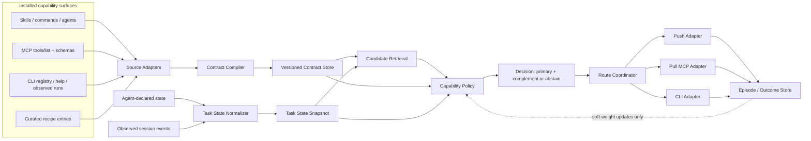
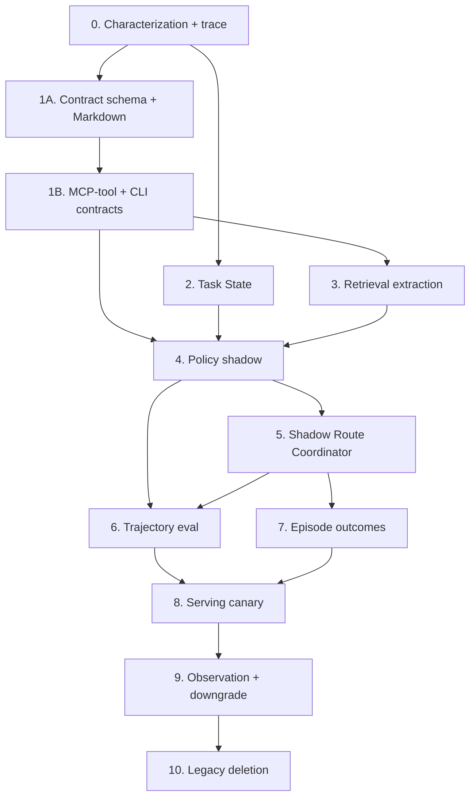

# Blueprint: Stateful Capability Policy Engine Refactor

Status: proposal for adversarial review
Date: 2026-07-11
Repository: `portable-harness-v2`
Primary objective: refactor the current capability retrieval pipeline into a state-aware capability policy engine that chooses the right capability at the right time, without a runtime LLM dependency and without exceeding 2x routing latency.

## 0. Refinement log — characterization spikes and workstream split (2026-07-11)

This section supersedes any part of §1–§7 it contradicts. Read it first. It records what two throwaway characterization spikes proved before any migration PR was cut, and the resulting decision to split the effort into two independent workstreams.

### 0.1 What the spikes proved

Two spikes attacked the two known hard-negative false positives (`hard-cross-host`, `hard-token-budget` in `docs/debug-fp-eval.jsonl` — both are meta-questions *about* the router's own domain that wrongly route the `portawhip` skill at tier `required`), each behind a default-off flag in `core/hybrid-router.mjs`, measured against the debug set, the 34-case main eval, and the 185-case unit suite.

- **Spike 1 — channel-agreement eligibility** (demote a sparse-only match that lacks dense/graph/feedback corroboration): **FAIL.** Dense cosine for `hard-cross-host` (0.5268) is *higher* than for a genuine positive `positive-surface-matrix` (0.4588). No corroboration floor can abstain the false positive without also killing the real positive — proven from the numbers, not a calibration miss. Also surfaced a design smell: `portawhip` is `origin:recipe`, and recipe entries are "trusted outright," so they currently bypass *every* eligibility gate.
- **Spike 2 — trigger-phrase coverage** (require the query to substantially cover an authored trigger phrase, i.e. declared-intent evidence, not accumulated topical prose): separates the 5 debug cases cleanly, **but FAIL on generalization.** `hard-token-budget`'s coverage signature (trigger "import tool", ratio 0.5) is mathematically identical to real positives `context7` ("sdk usage") and `github` (enriched triggers), both at ratio 0.5 — no threshold separates them. An absolute-count floor additionally breaks every capability authored with single-word triggers (the common case for auto-discovered skills), including a synthetic `"pdf"`→`"pdf"` 1/1 exact match.

**Decisive conclusion:** the two false positives cannot be fixed by any retrieval signal — lexical or embedding. The separator between a meta-question and an actionable request is *intent/meaning*, not vocabulary or surface form. This confirms anti-pattern §10 ("using embedding similarity as an eligibility gate") empirically, from two independent directions, and confirms that a reasoning signal is mandatory, not optional. The declared-intent-vs-topical split (spike 2) is a sound *soft signal* and should feed the relevance class, but it is not viable as a standalone deterministic gate. Both spikes' flag-gated code is default-off and must be stripped; they were characterization instruments, not implementations.

### 0.2 The false positives are a raw-prompt / reasoning-availability problem

The false positives fire whenever `route()` sees a raw meta-question. Whether that happens depends on whether the input carries reasoning:

- **push / CLI / eval** — always a raw prompt, no agent reasoning available → false positive fires.
- **pull** — the agent writes a summary; if it summarizes intent faithfully ("the user wants to discuss X") the text no longer matches the capability's triggers → false positive is avoided. Pull's summary *is* the reasoning signal.

The fix is not smarter retrieval; it is routing on reasoned input where it exists, and being conservative where it does not.

### 0.3 Workstream split

The two false positives and situation-state are different problems of different size. The central risk of the original single-engine plan was fusing them.

- **Workstream A — mode-differentiated intent (small, near-term).** Trust the reasoned input in pull; make push high-precision/conservative or silent. Add the declared-intent-vs-topical split as one *soft* relevance input. Do **not** build the contract compiler or policy engine to fix the false positives — the spikes proved retrieval eligibility cannot fix them. WS-A is a bounded change to delivery-mode behavior and relevance weighting.
- **Workstream B — situation-state engine (its own evidence gate).** The larger contract/state/policy work (the numbered Steps in §7). It must be justified by its own measured situation-state failures, **not** by the two false positives. If WS-B cannot show independent situation wins within the §5.2 cost ceiling, it is not built.

### 0.4 Situation-state leads with auto-observed state, not agent-declared state

§5 as originally written headlines `RouteRequestV1{query, state?}` with agent-declared fields and treats deterministic observation as one of three inputs. The code inverts this priority. The substrate for auto-observed state already exists, needs no daemon and no caller-protocol change:

- `.hp-state/feedback/events.jsonl` (`core/feedback.mjs`) — append-only, session-scoped, auto-pruned. Already logs `suggested` and `used` events with `sessionId` and `source: push|pull`.
- `adapters/hooks/universal-hook.mjs` — already fires on `session_start`/`user_prompt`/`post_tool`, already computes per-session suggestion counts and an interrupt budget (`sessionSuggestedCounts`).

Classify situation-state by source and cost:

| Tier | Fields | AI burden | Status |
|---|---|---|---|
| auto, free | host, mode (push/pull), alreadyUsed, interrupt-budget, sessionId, cwd | none | substrate exists |
| auto, cheap | recentEvents + tool outcomes, blockers (from failed events) | none | extend `post_tool` logging |
| soft heuristic | phase (from event pattern) | none | new reader over the log |
| must-declare | goal, nextAction, evidenceNeeded | high | defer until residual justifies |

The reliable eligibility gates the policy actually needs (§6.1: already-completed-its-job, interruption-budget-spent, unavailable, mode) all come from the auto-observed tier — the free, mostly-built tier. The unreliable signal (intent-polarity) is the only thing that needs reasoning, and it is available only in pull. Agent-declared intent is the expensive deferred tier, added only if a measured residual justifies its serialization burden — the same deterministic-first discipline §4.2 already applies to contracts.

Auto-observed state is also the *only* situation-state available to push (a fresh push process reads the shared session log by `sessionId` across processes; it cannot obtain agent-declared intent). This makes the cheap tier doubly valuable: it is both the low-cost core and the sole lever for the mode that most needs help, and it drives WS-A's mode differentiation.

### 0.5 Enrichment: deterministic Tier-1 first, LLM as a measured-gap fallback

Capability description quality is the make-or-break retrieval input; a poor document defeats any downstream policy. Enrichment runs at import time, never per route, so it does not touch the runtime latency ceiling — the "no LLM" concern is about trust and maintenance, not the ceiling.

- **Tier 1 (mandatory, deterministic, `declared`/`observed`):** mine MCP `inputSchema` fully (parameter names, enum values, `required`) — currently discarded per §4.1; full CLI `--help`; full skill/agent frontmatter. This is the largest cheap win and the actual gap behind "bare-name tools are dead."
- **Semantic bridge:** dense retrieval over the richer Tier-1 documents already handles "query wording ≠ tool name" without generating any text; it is already in budget. Do not pay for LLM prose before proving dense-over-Tier-1 is insufficient.
- **Measure the residual** with the §4.2 extraction-coverage report before considering an LLM.
- **LLM offline (only if residual remains):** expand authored facts into activation phrases (never invent capabilities), write as `inferred` → soft evidence only, cache by content hash, removable, scoped to third-party MCP/CLI surfaces only (author your own skills/recipes by hand as `declared`).

### 0.6 Adoption red flag (research item, blocks WS-B Step 7)

Route's MCP/CLI suggestions are, in practice, not being acted on — including by the maintainer. This is an actionability/trust problem, not a precision problem, and it is upstream of outcome attribution: WS-B Step 7 (episode/outcome learning) assumes suggestions are used, so if adoption is near zero there is no outcome to attribute and the learning loop runs on noise. Before investing in push routing or outcome learning, run a scoped research pass on *why* suggestions go unused (format, unusable pointer, unclear invocation, redundancy with tools the agent already holds).

## 1. Executive decision

Build this as a strangler migration, not a rewrite.

The target system has five deep Modules with narrow Interfaces:

1. **Contract Compiler** — compiles heterogeneous installed surfaces into versioned affordance contracts.
2. **Task State** — combines agent-declared intent with deterministic session observations.
3. **Candidate Retrieval** — embedding/sparse/graph channels generate a bounded candidate set; they do not make the final decision.
4. **Capability Policy** — applies eligibility, timing, utility, redundancy, interruption, and abstention policy.
5. **Outcome Learning** — records episodes and outcomes; any contextual bandit is a separate future RFC, not part of this migration.

Binding decisions:

- No LLM call in the runtime route path.
- Do not use an LLM to manufacture missing contract facts.
- Hard gates may use only typed executable predicates backed by user policy, host observation, or explicit structured capability annotations. Free-text activation/negative text is always soft evidence, even when authored.
- Track field provenance separately from evaluation certainty: an author may declare text, but matching that text to a task is still an inference.
- Parsed, agent-declared, or statistically inferred semantics may affect soft policy only and must carry provenance/confidence.
- Structured state is supplied in the existing route interaction; never add a second model call just to summarize state.
- Start with one composite state embedding. Add batched multi-vector embeddings only if evals prove a gap.
- Return at most one primary capability and one complementary capability by default.
- Silence remains a first-class decision.
- Push and pull are delivery modes over one decision engine, not independent routers. Each installed host profile selects exactly one route owner (`pull` or `push`); there is no prompt/summary fingerprint pretending to provide cross-mode exactly-once semantics.
- (Added 2026-07-11, see §0) The two known false positives are an intent-classification failure, not a retrieval-calibration one; they are not fixable by any retrieval eligibility signal, and their fix (Workstream A) must not be used to justify the situation-state engine (Workstream B).
- Recipe/curated trust applies to the retrieval bar and score calibration only; it must never exempt an entry from intent/eligibility gating. Curated is not the same as always-eligible-regardless-of-intent.
- Situation-state is led by auto-observed, hook-derived state (from the existing session event log); agent-declared intent is a deferred tier added only when a measured residual justifies its serialization cost.

## 2. Why this refactor exists

The current Implementation has useful pieces, but the Module boundaries are shallow:

- `core/capability-docs.mjs` parses a small subset of skill prose and flattens identity, triggers, activation, headings, and relationships into one retrieval string.
- The frontmatter parser is line-based, so it cannot reliably preserve full YAML semantics such as folded values, arrays, or nested contract fields.
- MCP enrichment calls `tools/list`, but retains only tool names plus up to three descriptions; input schemas and annotations are discarded.
- `core/hybrid-router.mjs` currently mixes document compilation, sparse retrieval, graph expansion, feedback factors, action alignment, origin-specific thresholds, dense retrieval, lane allocation, confidence classification, formatting, and diagnostic logging.
- Push receives the raw user prompt, disables dense retrieval, applies a confidence gate and an interruption budget.
- Pull receives a model-written summary, can use dense retrieval, and has different outcome semantics.
- The mandatory pull instruction and native push hook can both route the same task.
- The existing eval set tests isolated prompt/result pairs, not session trajectories, state transitions, push/pull duplication, or outcome attribution.

The two current hard-negative false positives are evidence of the architectural limit: sparse lexical overlap can place an irrelevant curated capability above its global threshold even when dense similarity is below threshold and no graph or feedback signal supports it. A larger global threshold loses a legitimate low-scoring positive. This is a missing eligibility/timing contract, not just a calibration problem.

## 3. Target architecture



The important Seam is between retrieval and policy:

- Retrieval answers: **what might be relevant?**
- Policy answers: **is it eligible now, is this the right time, and is its expected utility high enough to interrupt or recommend?**

## 4. Affordance contract

### 4.1 Proposed contract shape

Contract V1 is deliberately narrow. It describes facts the current surfaces can usually expose without semantic invention. Rich fields such as causal `enables`, inferred complements, broad phase taxonomies, and prose-derived risk are deferred until extraction coverage proves they are maintainable.

```json
{
  "schemaVersion": 1,
  "id": "context7.resolve-library-id",
  "kind": "mcp",
  "origin": "auto:mcp",
  "provider": "context7",
  "callable": {
    "name": "resolve-library-id",
    "pointer": "context7/resolve-library-id",
    "inputSchema": {
      "type": "object",
      "properties": {
        "libraryName": { "type": "string" }
      },
      "required": ["libraryName"]
    }
  },
  "description": "Resolve a library name to a Context7 library id.",
  "activationText": ["look up current official library documentation"],
  "annotations": {
    "readOnly": true,
    "destructive": false
  },
  "readiness": {
    "status": "observed_ready",
    "checkedAt": "2026-07-11T00:00:00Z"
  },
  "provenance": {
    "callable.inputSchema": { "source": "observed", "confidence": 1.0 },
    "description": { "source": "declared", "confidence": 1.0 },
    "activationText": { "source": "parsed", "confidence": 0.9 },
    "annotations.readOnly": { "source": "declared", "confidence": 1.0 },
    "readiness.status": { "source": "observed", "confidence": 1.0 }
  },
  "evaluation": {
    "activationMatch": { "method": "embedding", "certainty": null }
  }
}
```

Granularity rules:

- MCP: one contract per executable tool. The server is provider/group metadata, not the routed capability.
- Skill/command/agent: one contract per invocable surface.
- CLI V1: one contract per binary. Promote a subcommand to its own contract only when it has an independently extractable schema/description and meaningfully different effects.
- Recipe: one contract per curated executable pointer.

Author overrides stay next to an existing source of truth: native frontmatter/annotations when writable, otherwise the existing `recipe.yaml` entry keyed by stable capability id. Do not introduce a second central override registry.

Allowed provenance values:

- `declared` — explicit recipe/frontmatter/tool annotation maintained by the capability author.
- `observed` — live probe, actual schema, measured latency, or successful invocation.
- `parsed` — deterministically extracted from a named source section or machine-readable field.
- `inferred` — derived from embedding similarity, co-use, graph statistics, or heuristics.
- `unknown` — absent; never silently replace with a guess.

Field provenance alone never authorizes a hard gate. A hard gate also requires a typed predicate with deterministic evaluation. For example, `annotations.destructive: true` plus user policy `allowExternalWrites: false` may gate; a declared sentence such as “not for local source” may not.

Trust precedence for conflicts is:

1. explicit user policy and permission boundary;
2. direct host/runtime observation;
3. explicit typed capability annotation;
4. agent-declared task state;
5. parsed or inferred semantics.

Lower levels cannot override higher-level facts. Agent-declared phase/lanes guide soft policy unless the user or host supplied the same field as an enforceable constraint.

### 4.2 Extraction policy: deterministic first

| Surface | Extract automatically into V1 | Keep unknown / soft-only |
|---|---|---|
| Skill/command/agent Markdown | id, pointer, description, named activation/avoidance text, explicit typed frontmatter | prose-derived effects, phases, risk, complements, or causal jobs |
| MCP `tools/list` | one contract per tool: name, description, input schema, standard annotations when present | safety, cost, or side effects not declared by the server |
| CLI | binary, help text, package metadata, measured readiness/startup latency; subcommand metadata when structurally exposed | semantic preconditions or destructive effects inferred only from prose |
| Recipe | explicit V1 fields and typed overrides | malformed or non-schema fields fail validation |
| Runtime events | readiness, recent use, failure, repeated suggestion, observed latency | user intent |
| Episode history | success correlation, redundancy, adoption as policy evidence | contract facts or causation from correlation alone |

Use a real YAML parser and schema validation. Keep source-specific parsing inside Adapters; the Contract Compiler Interface receives normalized source records.

Before policy design is frozen, compile an extraction coverage report by surface and field. Policy V1 must remain useful when all optional semantic fields are `unknown`; otherwise the contract has become a manually curated registry in disguise.

An optional offline LLM enrichment tool may be evaluated later, but it must:

- run at import/enrichment time, never per route;
- write proposed fields as `inferred` with source text and model/version provenance;
- require human or deterministic confirmation before a field can become `declared`;
- be removable without changing runtime correctness.

It is not required for v1 of the contract system.

## 5. Structured task state

### 5.1 Proposed state shape

```json
{
  "schemaVersion": 1,
  "taskId": "optional-stable-id",
  "goal": "audit why route suggestions are noisy",
  "phase": "diagnosis",
  "nextAction": "trace the current routing path",
  "blockers": [],
  "evidenceNeeded": ["call path", "false-positive score trace"],
  "recentEvents": [
    { "type": "codegraph_query", "outcome": "success" }
  ],
  "alreadyUsed": ["agent-architecture-audit"],
  "allowedLanes": ["skill", "tool"],
  "interruptionMode": "pull",
  "host": "codex",
  "constraints": {
    "allowExternalWrites": false,
    "source": "user_policy"
  },
  "budgets": {
    "maxSuggestions": 2,
    "maxOutputChars": 640
  },
  "provenance": {
    "goal": "agent_declared",
    "recentEvents": "observed",
    "alreadyUsed": "observed"
  }
}
```

State has three trust-separated inputs:

1. **User/host policy** — permissions and enforceable constraints. These may drive typed hard gates.
2. **Agent-declared intent** — `goal`, `phase`, `nextAction`, `blockers`, `evidenceNeeded` are sent as arguments in the same route call. This costs serialization tokens, not another model inference. These are soft context unless they restate an independently verified user/host constraint.
3. **Deterministic observation** — host, cwd, recent tools, success/failure, readiness, previous suggestions, and session budget are projected from hooks/events.

The router must accept the old `query: string` form throughout migration. Missing structured fields remain `unknown`; they must not be guessed from keywords and used as hard gates.

### 5.2 Cost budget

The cost target is realistic only if no state-extraction model call is introduced.

Hard budgets:

- Additional runtime LLM calls: **0**.
- Warm p95 route latency: target `<= 1.5x` same-mode baseline; hard ceiling `<= 2.0x`.
- End-to-end route input+output tokens, route-call count, and peak RSS: each reported by mode; none may exceed `2.0x` without a separate user decision.
- Cold dense-model load and contract/index compilation are measured separately and must have both absolute and relative ceilings.
- Embedding work in the first policy release: one composite state string and one query embedding.
- Later multi-vector mode: at most three query vectors, batched in one model invocation, enabled only by an eval-backed feature flag.
- Default decision size: at most two capabilities.
- Push output: retain the existing `640` character hard ceiling; target a lower median through the two-capability portfolio.
- Contract document vectors remain cached by content hash.

Step 0 must pin the baseline commit, hardware/OS, fixed contract snapshot, model/cache state, and run counts. Benchmark these paths independently:

1. push hook, fresh process, sparse only;
2. MCP cold/nonblocking dense path;
3. MCP warm dense path;
4. CLI cold/blocking path;
5. contract compile/index refresh.

Use at least 5 cold runs and 30 warm runs per case. The Step 0 report must commit numeric absolute ceilings before Step 4 begins; a relative ratio alone is invalid when the baseline is near zero. Measure wall time, peak RSS, embedding invocations, route calls, serialized state bytes, router output bytes, and end-to-end tool-call tokens.

The structured state itself should be bounded to 1 KiB serialized, and those bytes must be counted in end-to-end model/tool-call token measurements. If a caller has more history, it passes ids/counters, not a transcript. A state handle is allowed only when the backing store already exists; this plan does not justify a new daemon.

## 6. Decision policy v1

Policy v1 is deterministic and inspectable.

### 6.1 Eligibility gates

Reject a candidate before utility scoring when a reliable contract/state fact proves any of:

- capability is observed unavailable or an executable precondition predicate is false;
- a user/host permission constraint conflicts with an explicit typed side-effect annotation;
- an enforceable user/host phase or mode enum explicitly excludes the capability;
- capability has already completed its job for this task and is not repeatable;
- push interruption is forbidden or its session interruption budget is spent.

Free-text positive/negative signals, including authored `not_for` prose, never hard-gate because deciding that the task matches the prose is itself an inference. Agent-declared phase and allowed lanes are soft unless independently backed by user/host policy. Unknown is not false; missing metadata cannot create a rejection by itself.

Intent-polarity gate boundary (added 2026-07-11, see §0.1). The two characterization spikes proved that "meta-question about a capability's domain" versus "actionable request for it" cannot be separated by any retrieval signal — sparse, dense, or trigger-phrase coverage. Therefore the eligibility gates here must not attempt an intent decision from retrieval scores; intent enters only as reasoned input (a pull summary, or agent-declared state) and otherwise stays a soft relevance factor. Recipe/curated origin must be subject to these same eligibility gates: the current "trusted outright" bypass (which let `portawhip` false-positive) is a bug the policy must not inherit — recipe trust affects the bar and score calibration only.

### 6.2 Utility score

Do not replace the current opaque score with a longer opaque sum. Policy V1 uses a lexicographic cascade:

1. **Typed eligibility** — pass/fail/unknown from Section 6.1.
2. **Relevance class** — calibrated `high | medium | low` from sparse, dense, exact-id, and graph evidence.
3. **Timing class** — `now | later | no_evidence`, based on trusted state plus bounded soft phase/evidence fit.
4. **Portfolio utility** — choose primary, then compute the marginal value of at most one complement after redundancy/interruption/latency costs.
5. **Mode threshold** — push requires a stronger class/margin than pull; otherwise abstain.

Within a stage, every numeric transform must declare input scale, normalization method, monotonicity, output range, cap, weight source, calibration dataset, and policy version. Sparse scores in the hundreds and cosine similarity in `[0,1]` must never be directly added. Raw channel evidence and transformed values both appear in the trace.

Embedding similarity contributes to relevance only; it cannot override a typed eligibility gate. Free-text negative similarity can lower relevance/timing confidence but cannot create a deterministic rejection.

### 6.3 Portfolio and abstention

- Select zero or one primary capability.
- Optionally add one complement only when it enables a distinct sub-job and its marginal utility clears a separate threshold.
- Apply redundancy suppression between near-duplicate skills/tools.
- Push uses a higher interruption threshold than pull.
- Abstain when no primary clears the mode-specific minimum expected utility.

## 7. Construction steps

Each numbered or lettered step is intended to be one reviewable PR. Preserve backward compatibility until the final cutover.

### Workstream map (added 2026-07-11, see §0.3)

The numbered Steps 0–10 below are **Workstream B** (the situation-state engine). They are gated by §0's evidence rules: the two spikes in §0.1 already discharged part of Step 0's characterization and established that the two false positives are **not** retrieval-fixable, so no WS-B step may be justified by them. Within WS-B, the §0.4 ordering constraint applies: auto-observed state (host, mode, `alreadyUsed`, interrupt-budget from the existing `.hp-state/feedback/events.jsonl`) is implemented and wired to eligibility **first**; agent-declared intent fields (`goal`, `nextAction`, `evidenceNeeded`) are added last and only if a measured residual justifies them.

**Workstream A** below is a separate, smaller track and ships independently of B.

### Workstream A — mode-differentiated intent (near-term, independent of B)

Dependencies: none (uses the current router plus the existing feedback log)
Recommended model: strongest available
Primary files: `core/hybrid-router.mjs`, `adapters/hooks/universal-hook.mjs`, `core/route-entry.mjs`, `adapters/instructions/`

Context brief: two spikes (§0.1) proved the two false positives cannot be separated from real positives by any retrieval signal; the separator is intent, available only as reasoning (§0.2). This track fixes them by delivery-mode behavior, not by smarter retrieval.

Tasks:

1. Push (and any raw-prompt entry point): treat as high-precision. Raise the interruption threshold so borderline topical-only matches do not fire, or make push silent-by-default pending the §0.6 adoption research. Do not attempt intent classification on a raw prompt.
2. Pull: trust the agent-written summary as the reasoning signal; do not re-expand it into raw-prompt matching. Accept agent-declared intent fields when present.
3. Add the declared-intent-vs-topical split (spike 2's `triggerCoverageEvidence`, generalized) as one soft input to the relevance class — never a standalone gate.
4. Wire `mode` and `alreadyUsed` from the existing feedback log as the first deterministic signals (this is the bridge into WS-B Step 2).
5. Strip both spike flags (`PORTAWHIP_SPIKE_CHANNEL_AGREEMENT`, `PORTAWHIP_SPIKE_TRIGGER_COVERAGE`) once their evidence is captured in §0 and here.

Verification:

- Both named false positives abstain in push and pull, with no id/prompt-specific override and no new-eval regression.
- No runtime LLM call is added.
- `npm test` and `npm run route:eval` pass.

Exit criteria:

- The two false positives are fixed by mode/relevance behavior, not by a per-id hack or a global threshold bump.
- Retrieval remains topical; intent enters only via reasoned input (pull) or conservative delivery (push).

Rollback: feature-flag the mode-differentiated behavior; restore current uniform behavior.

### Step 0 — Freeze evidence and build a characterization harness

Dependencies: none
Recommended model: strongest available
Primary files: `core/router-eval.mjs`, `core/router-cli.mjs`, `docs/router-eval-set.jsonl`, new `core/decision-trace.mjs`, tests

Context brief:

The current router is behaviorally entangled. Refactoring without a stable observation surface risks changing ranking, delivery, and feedback simultaneously. Two temporary false-positive diagnostics currently live in `core/hybrid-router.mjs`, with a temporary fixture in `docs/debug-fp-eval.jsonl`; replace them with a general trace Interface before deleting them.

Tasks:

1. Add a structured decision trace behind an explicit CLI/test flag; default runtime output stays unchanged.
2. Record channel scores, gates, factors, lane decisions, thresholds, and final classification per candidate.
3. Add the two known false-positive cases to the permanent regression corpus with expected abstention, but mark current legacy behavior as a known failure rather than hiding it or blocking characterization CI.
4. Snapshot baseline metrics for keyword, hybrid sparse-only, and hybrid dense modes using the pinned benchmark protocol in Section 5.2.
5. Add route-call telemetry for mode, latency, input/output size, candidate count, and duplicate decision key; do not log sensitive prompt text by default.
6. Add trajectory fixture support even if initial trajectories contain one turn.
7. Compile an extraction coverage report across current skill/command/agent, MCP-tool, CLI, and recipe surfaces. Report the percentage of contracts with each V1 field and how many fields would remain `unknown`.
8. Freeze separate tuning and held-out contract/eval snapshots; unseen-capability tests must not share authored overrides with the tuning set.
9. Remove the ad-hoc `PORTAWHIP_DEBUG_ROUTE_FP` instrumentation and temporary fixture only after equivalent trace coverage exists.

Verification:

```powershell
npm test
npm run route:eval
npm run route:compare
```

Exit criteria:

- Existing behavior is reproducible from permanent fixtures.
- Both known false positives are named regression cases.
- A trace explains every accepted/rejected candidate without ad-hoc logging.
- Baseline report pins commit, hardware, snapshots, run counts, mode-specific latency/RSS/tokens/calls, and numeric absolute plus relative ceilings under `docs/`.
- Contract V1 scope is confirmed or reduced using the extraction coverage report before policy work.

Rollback: trace code is feature-flagged and can be removed without touching routing behavior.

### Step 1A — Define Contract V1 and compile recipe/Markdown surfaces

Dependencies: Step 0
Can run in parallel with: Step 2
Recommended model: strongest available
Primary files: new `core/contracts/`, `core/capability-docs.mjs`, `core/discover.mjs`, `core/registry.mjs`

Context brief:

Source discovery, prose parsing, and retrieval-document construction currently share an implicit schema. This PR establishes the narrow Contract V1 and proves it on recipe plus Markdown surfaces. Existing callers continue through a compatibility Adapter.

Tasks:

1. Define JSON Schema or equivalent runtime validation for `AffordanceContractV1`.
2. Implement source Adapters for recipe and Markdown skill/command/agent.
3. Replace line-based YAML parsing with a real YAML parser.
4. Attach per-field provenance and evaluation certainty separately; represent absence as `unknown`.
5. Add content-hash versioning so unchanged contracts and embeddings stay cached.
6. Implement `contractToRetrievalDocument(contract)` as a compatibility Adapter for `buildCapabilityDocs`.
7. Keep the existing index/output format stable during this PR.

Verification:

- Fixture tests for folded YAML, lists, nested fields, malformed schemas, missing fields, and duplicated installed surfaces.
- Golden test proves old capability docs are unchanged except intentional parser fixes.
- `npm test` and current route eval pass.

Exit criteria:

- Every recipe/Markdown capability has a valid versioned contract.
- Compiler never marks prose-derived or inferred semantics as executable predicates.
- Discovery/enrichment logic no longer writes retrieval-specific flattened fields directly.

Rollback: old `buildCapabilityDocs` remains available behind the compatibility Adapter until Step 10.

### Step 1B — Add MCP-tool and CLI Contract Adapters

Dependencies: Step 1A
Can run in parallel with: Step 2
Recommended model: strongest available
Primary files: `core/contracts/`, `core/enrich.mjs`, `core/cli-enrich.mjs`, `core/discover.mjs`, enrichment fixtures

Context brief:

MCP currently routes at server granularity and discards tool schemas; CLI metadata is description-heavy and semantically weak. This PR adds surface-specific Adapters without widening Contract V1 to fields the sources cannot support.

Tasks:

1. Emit one MCP contract per tool and preserve server/provider identity separately.
2. Preserve `inputSchema` and standard MCP annotations exactly; do not infer missing side effects.
3. Emit one CLI contract per binary by default; promote structured subcommands only under the granularity rule in Section 4.1.
4. Preserve live readiness and measured latency as observed fields with timestamps.
5. Re-run the extraction coverage report and compare it with Step 0.
6. Version contract/index cache filenames and provide dual-read compatibility with the legacy index.

Verification:

- MCP fixtures prove two tools on one server remain distinct contracts and retain different schemas.
- CLI fixtures cover structured subcommands, prose-only help, unavailable binary, and ambiguous destructive wording.
- Policy-neutral compatibility docs preserve legacy routing behavior.
- `npm test` and current route eval pass.

Exit criteria:

- Every routed surface has a valid contract at the declared granularity.
- Policy can operate when optional semantic coverage is near zero.
- No second override registry exists.

Rollback: disable new surface Adapters and dual-read the legacy index; versioned cache files are not overwritten.

### Step 2 — Introduce the Task State Module and route request schema

Dependencies: Step 0
Can run in parallel with: Steps 1A and 1B
Recommended model: strongest available
Primary files: new `core/state/`, `core/route-entry.mjs`, `server/mcp-server.mjs`, `core/router-cli.mjs`, `adapters/hooks/universal-hook.mjs`

Context brief:

Push, pull, CLI, and eval currently supply different context. This PR defines one `RouteRequestV1` and one Task State normalization path while preserving `query: string` callers.

Tasks:

1. Define and validate `RouteRequestV1 { query, state?, mode? }`.
2. Add bounded fields from Section 5; reject oversized/unrecognized nested payloads safely.
3. Project deterministic hook/session events into observed state.
4. Merge agent-declared and observed fields with explicit provenance; observed facts win only in their own domain.
5. Produce one canonical state text for the existing retrievers.
6. Add optional caller-supplied `requestId`/`taskId` fields for idempotency when available. Do not derive an exactly-once identity by equating raw prompts with model summaries.
7. Define a validated host delivery profile with a single `routeOwner: pull | push`; serving remains legacy until the coordinator/canary steps.
8. Extend MCP and CLI schemas while keeping the old query-only form valid.

Verification:

- Schema compatibility tests for old and new callers.
- Same request through push/pull/CLI normalizes to the same semantic state where inputs are equivalent.
- State is capped at 1 KiB and cannot inject arbitrary router configuration.
- No additional LLM call is made.
- `npm test` passes.

Exit criteria:

- All entry points call one state normalizer.
- Route core no longer receives an untyped bag of caller-specific context.

Rollback: callers can omit `state`; the canonical query falls back to the current prompt behavior.

### Step 3 — Extract Candidate Retrieval from `hybrid-router.mjs`

Dependencies: Steps 0 and 1B
Can run in parallel with: late Step 2 work, if `route-entry.mjs` is not touched
Recommended model: default for mechanical extraction; strongest for final review
Primary files: new `core/retrieval/`, `core/hybrid-router.mjs`, existing sparse/dense/graph/fusion modules

Context brief:

The current router mixes retrieval with policy and formatting. This PR creates Depth by moving all candidate generation behind a stable Interface without changing accepted results.

Tasks:

1. Define `retrieveCandidates(contracts, taskState, options) -> CandidateEvidence[]`.
2. Move sparse, dense, and graph expansion orchestration behind that Interface.
3. Preserve channel-native scores; do not pretend sparse and cosine scales are directly comparable.
4. Make channel evidence explicit: matched terms, similarity, graph edge, source, and rank.
5. Preserve current RRF/lane behavior byte-for-byte in a legacy policy Adapter, even where it appears redundant; removing single-list RRF is a later semantic policy change.
6. Keep existing thresholds/classification in the same legacy policy Adapter for behavior parity.
7. Batch/cache embeddings by content hash; initial state embedding remains one vector.

Verification:

- Golden characterization tests show identical legacy decisions and ordering.
- Dense unavailable/cold/warm paths fail soft exactly as before.
- Unit tests directly cover sparse, dense, graph, and fusion evidence.
- Benchmark reports warm/cold latency and cache hit rate.

Exit criteria:

- Retrieval has no knowledge of push/pull budgets, interruption policy, final tiers, or output formatting.
- `hybrid-router.mjs` becomes a compatibility facade, while the complete legacy decision Implementation remains callable for rollback.

Rollback: switch facade back to the legacy in-file path until parity gaps are fixed.

### Step 4 — Implement deterministic Capability Policy v1 in shadow mode

Dependencies: Steps 1B, 2, and 3
Recommended model: strongest available
Primary files: new `core/policy/`, decision trace, eval fixtures

Context brief:

This is the semantic architecture change. The policy consumes contract facts, structured task state, and candidate evidence. It must not replace one opaque score with another.

Tasks:

1. Implement eligibility gates from Section 6.1.
2. Implement the lexicographic cascade from Section 6.2 with versioned transforms, ranges, caps, and calibration sources.
3. Add mode-specific interruption costs and thresholds.
4. Add redundancy suppression and primary/complement portfolio selection.
5. Add explicit abstention reason codes.
6. Run legacy and policy decisions side-by-side; serve legacy results only.
7. Persist comparison records without prompt text unless debug mode explicitly enables it.

Verification:

- Unit tests for every eligibility gate and utility term.
- Known false positives are rejected by general typed eligibility or calibrated relevance/timing policy, not an id-specific override or a larger global threshold.
- Known weak positive remains eligible when its preconditions and phase fit.
- Property tests: adding a reliable negative signal cannot increase utility; exhausting interruption budget cannot make push more likely; an unavailable capability cannot be selected.
- Shadow comparison report on the full static and trajectory eval corpus.

Exit criteria:

- Every shadow decision has a complete trace.
- Policy meets or exceeds baseline positive coverage while eliminating the named hard negatives.
- No runtime behavior changes yet.

Rollback: disable shadow execution with one feature flag.

### Step 5 — Add a shadow Route Coordinator and single-owner delivery profiles

Dependencies: Step 4
Recommended model: strongest available
Primary files: new `core/route-coordinator.mjs`, `core/route-entry.mjs`, `server/mcp-server.mjs`, `adapters/hooks/universal-hook.mjs`, `adapters/instructions/`

Context brief:

Push sees a raw prompt in a fresh process; pull sees a model-written summary and may never be called. They do not share a trustworthy turn id, so prompt hashing cannot provide exactly-once semantics. Avoid a new daemon: select one route owner per installed host profile, and run the coordinator in shadow mode until trajectory gates pass.

Tasks:

1. Define one `decide(RouteRequestV1)` core Interface and delivery profiles for push, pull, and CLI.
2. Validate `routeOwner: pull | push` as mutually exclusive per host profile:
   - pull owner: hook may record observed state but never routes/delivers; if pull is not called, the system stays silent;
   - push owner: hook routes/delivers and generated instructions do not require pull for that task;
   - CLI remains explicit and outside automatic delivery ownership.
3. Keep legacy serving unchanged; compute coordinator/policy decisions in shadow only.
4. Support idempotent retries only when the caller supplies a stable `requestId`. Without one, record repeated calls honestly rather than claiming exactly-once behavior.
5. Preserve push's stricter interruption threshold and pull's higher recall.
6. Generate owner-consistent instruction blocks and validate there is no profile that enables both automatic paths.
7. Log episode ids where they can be carried reliably; do not merge episodes solely because prompt and summary embeddings are similar.

Verification:

- Integration tests simulate pull-owned and push-owned hosts and assert only the owner can deliver.
- Test pull not called, pull repeated with and without `requestId`, pull summary unlike raw prompt, hook process restart, and coordinator unavailable.
- Retries with a stable `requestId` are idempotent; other repeats remain distinct observable calls.
- When exercised separately in adapter tests, push and pull may render differently but consume the same candidate-evidence schema.
- Existing hook fail-open behavior remains intact.
- Cross-host tests cover Codex, Claude Code, and Gemini payload shapes.

Exit criteria:

- Host profiles cannot activate both automatic route owners.
- Entry-point Adapters contain host translation only; no ranking/policy logic.
- Runtime behavior is still legacy; coordinator differences are shadow records only.

Rollback: feature flag restores current push/pull ownership while retaining normalized state.

### Step 6 — Build trajectory evals and enforce cost/quality gates

Dependencies: Steps 4 and 5
Can run in parallel with: Step 7 data-model work
Recommended model: strongest available for case design
Primary files: `core/router-eval.mjs`, new trajectory fixtures/reporter, package scripts, docs report

Context brief:

Static prompt retrieval metrics cannot validate timing, duplication, complementarity, or feedback. The new architecture must be judged on session trajectories.

Tasks:

1. Add trajectory fixtures containing goal, phase transitions, tool outcomes, prior suggestions, and expected decisions per turn.
2. Cover at least:
   - relevant now vs relevant later;
   - capability already used;
   - blocker makes a tool newly useful;
   - primary plus valid complement;
   - redundant capability suppression;
   - push interruption budget exhaustion;
   - push+pull duplicate prevention;
   - unavailable capability;
   - missing, stale, contradictory, and incorrect agent-declared state;
   - paraphrases and acceptable alternative capabilities;
   - unseen capabilities with no case-specific overrides;
   - both current false-positive cases.
3. Keep tuning and held-out adversarial sets physically separate. The held-out set uses a separately frozen contract snapshot and is not consulted while calibrating transforms.
4. Report exact-id metrics plus opportunity-level recall, acceptable-alternative success, mode/lane precision, abstain accuracy, timing accuracy, duplicate-delivery rate, average portfolio size, output chars, warm/cold p50/p95 latency, peak RSS, route-call count, end-to-end tokens, and embedding cache hit rate.
5. Compare legacy and policy shadow results on the same fixed contract snapshots.
6. Add CI quality gates and an explicit anti-hardcode check for case ids/prompts in policy/config.

Required release gates:

- Existing named negative cases and held-out paraphrases: 100% abstain, with no id/prompt-specific overrides.
- No regression in opportunity-level recall on curated positives; exact-id differences are allowed only when the selected capability is an accepted alternative.
- Duplicate automatic delivery rate: 0 for single-owner host profiles.
- Average selected capabilities: `<= 2`.
- Additional runtime LLM calls: 0.
- Every benchmark mode stays within its committed absolute ceiling; warm p95 latency is also `<= 2.0x` same-mode baseline, target `<= 1.5x`.
- Peak RSS, route-call count, and end-to-end route tokens stay within their committed Step 0 ceilings.
- Push output never exceeds 640 characters.
- Every decision/abstention has a trace reason.

Exit criteria:

- A committed report demonstrates all hard gates.
- Failure output identifies the trajectory and policy term responsible.

Rollback: eval-only; no runtime rollback needed.

### Step 7 — Replace suggestion counters with episode/outcome attribution

Dependencies: Step 5
Can run in parallel with: Step 6
Recommended model: strongest available
Primary files: new `core/outcomes/`, `core/feedback.mjs`, hook event resolution, eval harvest

Context brief:

Current feedback factors are capability-level streaks over suggested/used events. Policy learning needs a decision episode tying state, eligible set, selected portfolio, delivery mode, use, and task outcome together.

Tasks:

1. Define append-only `DecisionEpisodeV1` and `OutcomeEventV1` schemas.
2. Correlate suggestion/use/failure/success by episode id and stable caller request/task id when available; never merge solely by prompt similarity.
3. Preserve push ignored vs pull unclicked semantics.
4. Record propensity/eligible set needed for later offline policy evaluation.
5. Implement deterministic aggregates and bounded soft weights.
6. Version cache/log filenames (for example `route-index-v1.json`, `episodes-v1.jsonl`) and implement dual-read/dual-write where rollback requires it.
7. Keep current feedback factors and legacy event reader behind an Adapter until a real canary release and downgrade exercise complete.
8. Do not add a bandit yet; collect clean data first.

Verification:

- Replay tests rebuild identical aggregates from append-only events.
- Pull non-use is neutral; push ignored is a bounded negative; observed success is positive.
- Synthetic prompts and phantom suggestions remain excluded.
- Corrupt/truncated event lines fail soft and are observable.
- Upgrade/downgrade tests prove the prior release can run without corrupting or misreading new persistent state.

Exit criteria:

- Outcome data can answer which state/capability/action produced value.
- Policy weights are reproducible from the event log.

Rollback: switch aggregate reader back to legacy factors; event log remains append-only.

### Step 8 — Serve the policy through a staged canary

Dependencies: Steps 6 and 7
Recommended model: strongest available
Primary files: policy config, coordinator, entry-point Adapters, canary reporter

Context brief:

This is the first runtime behavior change. The complete legacy Implementation and persistent-state compatibility remain intact. The single-owner host profile, not a cross-mode fingerprint, prevents duplicate automatic delivery.

Tasks:

1. Enable policy serving for CLI/eval first, then pull-owned profiles, then push-owned profiles.
2. Run a deterministic session canary with immediate per-request legacy fallback.
3. Ensure each host has exactly one configured route owner before enabling automatic delivery.
4. Compare adoption, abstention, delivery duplication, latency, RSS, tokens, and reported false positives.
5. Keep dual-read/dual-write persistent state and the untouched legacy decision path.
6. Emit a canary report using the exact Step 0 mode baselines and Step 6 quality gates.

Serving gates:

- Static and held-out trajectory release gates remain green.
- All mode-specific absolute/relative cost ceilings remain green.
- Push false-positive rate is no worse than legacy and improves on the general hard-negative class, not only the two named cases.
- Pull opportunity-level recall is no worse than legacy.
- Automatic duplicate delivery is zero under single-owner profiles.

Exit criteria:

- Policy canary serves real sessions with immediate legacy fallback.
- Legacy and new persistent formats coexist safely.

Rollback: disable policy serving; legacy code and readable legacy state remain present.

### Step 9 — Hold an observation release and exercise downgrade

Dependencies: Step 8
Recommended model: default for monitoring, strongest for go/no-go review
Primary files: reports/docs only unless a proven defect requires a scoped fix

Context brief:

Do not combine canary and deletion. Hold at least one release with both Implementations present so rollback is real rather than theoretical.

Tasks:

1. Observe a predefined minimum number of real decision episodes and at least one normal release interval; set the numeric minimum before enabling Step 8.
2. Segment results by owner mode, capability kind, host, cold/warm path, and state completeness.
3. Exercise downgrade to the prior release against copies of the real versioned caches/logs.
4. Exercise coordinator/policy unavailable behavior and verify fail-open/fallback semantics.
5. Record a go/no-go decision with unresolved regressions and rollback evidence.

Exit criteria:

- Numeric serving gates hold over the observation window.
- A real downgrade exercise succeeds without state corruption or unreadable logs.
- No critical unexplained false-positive, latency, memory, or duplication regression remains.

Rollback: remain on legacy serving and preserve collected episode data for diagnosis.

### Step 10 — Delete legacy decision logic and compatibility Adapters

Dependencies: Step 9 go decision
Recommended model: strongest available
Primary files: legacy router facade, origin-threshold branches, compatibility readers/Adapters, docs

Context brief:

Deletion is a separate irreversible cleanup PR after a successful observation release. Keep migration readers for any state that still exists in supported installations.

Tasks:

1. Remove the legacy decision Implementation and obsolete origin-specific threshold branches.
2. Remove compatibility Adapters only when no supported caller/state file requires them.
3. Retain explicit migration tooling for old cache/event formats or document safe regeneration.
4. Remove temporary/shadow comparison storage and feature flags.
5. Update `VISION.md`, `HANDOFF.md`, architecture docs, and operator commands.
6. Tag the final legacy-capable release and document downgrade limits.

Exit criteria:

- New policy is the only decision Implementation.
- Supported existing installations migrate or regenerate state safely.
- Full static, trajectory, cost, upgrade, and downgrade test suites pass.

Rollback: revert to the tagged legacy-capable release using its documented state migration path.

### Deferred RFC — Contextual bandit

A contextual linear bandit is not part of this migration. Consider it only after Step 9 produces enough clean, attributable episodes. It may tune soft within-stage policy parameters in shadow mode, after offline/doubly robust evaluation, but it may never bypass typed eligibility, permissions, interruption budgets, or risk constraints.

## 8. Dependency graph and parallelism



Safe parallel work:

- Steps 1A and 2 after Step 0, then Step 1B can continue alongside late Step 2 because they primarily touch contract and state directories.
- Step 3 may overlap late Step 2 work if ownership of `core/route-entry.mjs` is reserved for Step 2.
- Steps 6 and 7 after Step 5.

Do not parallelize Steps 3, 4, and 5 across the same `hybrid-router`/entry-point files without explicit file ownership; that would recreate the current coupling during the refactor.

## 9. Branch and review protocol

Suggested branch sequence:

```text
codex/router-characterization
codex/contract-schema-markdown
codex/contract-mcp-cli
codex/task-state
codex/retrieval-seam
codex/policy-shadow
codex/route-coordinator
codex/trajectory-eval
codex/outcome-episodes
codex/policy-canary
codex/policy-observation
codex/legacy-router-deletion
```

Each PR must:

1. Rebase/merge the latest preceding dependency.
2. State which behavior is intentionally unchanged and which behavior changes.
3. Include the decision trace or eval evidence relevant to the change.
4. Run `npm test`, `npm run route:eval`, and any step-specific benchmark.
5. Document rollback before merge.
6. Avoid mixing refactor and tuning unless the PR is explicitly the policy step.

Remote publication is currently blocked until GitHub CLI authentication is repaired; local branches/commits can still follow this sequence.

## 10. Anti-patterns to reject in review

- One `score` that silently mixes lexical, cosine, graph, feedback, phase, and risk scales.
- Using embedding similarity as an eligibility or safety gate.
- Using authored free text as a hard gate merely because its field provenance is `declared`.
- An LLM call that converts prompt text into state on every route.
- Auto-generated `not_for`, side effects, or preconditions treated as facts.
- A second hand-maintained registry disconnected from installed surfaces.
- A large `RouterContext` bag shared by every Module.
- Caller-specific thresholds embedded in hook/server/CLI Adapters.
- Enabling both push and pull as automatic route owners for one host profile, or claiming exactly-once by hashing unlike prompt/summary text.
- Tuning on live mutable installed capabilities without a fixed contract snapshot.
- Rewarding mere clicks/tool calls without task outcome attribution.
- Introducing a bandit before clean episode data exists.
- Big-bang replacement of `hybrid-router.mjs`.
- Deleting legacy readers/Implementation before a real canary release and downgrade exercise.

## 11. Plan mutation protocol

If implementation evidence invalidates a step:

1. Record the observation and affected invariant in a short ADR or the plan changelog.
2. Keep completed step artifacts; do not rewrite history to make the old plan appear correct.
3. Split a step when it exceeds one reviewable PR or touches more than two architectural Seams.
4. Insert a new step only when a measured gap cannot be closed within an existing Module.
5. Keep the deferred bandit RFC closed if deterministic policy meets the outcome goals.
6. Abandon the migration if the Step 4 shadow policy cannot beat baseline within the 2x cost ceiling; preserve the Contract and Task State Modules if they independently improve observability.

## 12. First adversarial review disposition

The initial adversarial review found three critical blockers and five major revisions. This draft incorporates them as follows:

- Replaced prompt/summary fingerprint exactly-once claims with mutually exclusive per-host route ownership and explicit failure tests.
- Restricted hard gates to typed executable predicates and separated field provenance from match/evaluation certainty.
- Reduced Contract V1 to extractable facts, chose per-tool MCP granularity, and added an extraction coverage gate.
- Split Contract work into Steps 1A/1B and split canary, observation/downgrade, and legacy deletion into Steps 8/9/10.
- Kept Step 3 mechanical; semantic RRF/ranking changes now belong to shadow policy.
- Expanded cost benchmarks by runtime mode, memory, compile cost, route calls, state bytes, and end-to-end tokens.
- Added held-out/unseen/missing-state evals and opportunity-level metrics.
- Replaced a flat additive utility sum with a versioned lexicographic cascade.
- Added versioned persistent state, dual-read/dual-write, and downgrade testing.
- Deferred contextual bandits to a separate RFC.

## 13. Questions for Claude's adversarial review

Claude should challenge, not merely summarize, these points:

1. Is the proposed contract expressive enough to decide readiness/timing without becoming another giant registry?
2. Which fields can really be extracted deterministically from current skills/MCP/CLI surfaces, and where should `unknown` remain?
3. Are any hard gates incorrectly based on agent-declared or inferred facts?
4. Is the one-composite-embedding starting point sufficient, or is batching multiple state views necessary from day one?
5. Does the Route Coordinator's ownership rule work across Codex, Claude Code, and Gemini hook/tool behavior?
6. Can Step 3 preserve behavior exactly, or should origin-threshold logic move to the legacy policy Adapter first?
7. Are the latency/token budgets measurable and resistant to benchmark gaming?
8. What minimum clean episode count is required before even shadow-testing a contextual bandit?
9. Which Step boundaries are too large for one PR?
10. What is the simplest architecture that still fixes both known false positives for a principled reason?

## 14. Definition of done

The migration is complete when:

- installed surfaces compile into versioned affordance contracts with field provenance;
- all route entry points consume one bounded structured state schema;
- retrieval is a replaceable candidate-generation Implementation behind a stable Seam;
- deterministic policy owns eligibility, timing, portfolio selection, and abstention;
- each installed host profile has one automatic route owner, and push/pull do not duplicate automatic delivery;
- runtime LLM calls remain zero;
- warm p95 route latency remains at or below 2x baseline;
- named hard negatives abstain without sacrificing curated positives;
- stateful trajectory evals pass;
- outcomes are attributable to decision episodes;
- legacy router decision logic and temporary debug instrumentation are removed.
